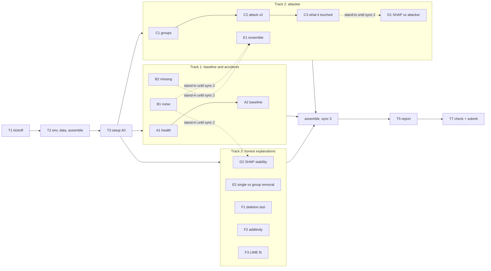

# Lab 4.2 Task List: Robustness, Attacks and Honest Explanations

- **Course:** AI for Cybersecurity (D7084E / D7041E)
- **Deadline:** ____________ (copy it from Canvas)
- **Random seed:** `random_state=42` everywhere (the lab requires it)
- **Lab instructions:** `Robustness attacks.pdf` (same text in `Robustness attacks.txt`)

This file turns the Lab 4.2 instructions into tasks that several people can work on at the same time.
It assumes **no background** in cybersecurity or machine learning: section 0 explains every word you
need, and every task says *why* it exists before it says *what* to do.

How the file is organised:

| Section | What it gives you |
|---|---|
| [0. Words you need](#0-words-you-need-read-this-first) | Plain-language glossary. Read it once before starting |
| [1. Starting point](#1-starting-point-checked-on-2026-10-04) | What is already in this folder, and how our data differs from the PDF |
| [2. How we work in parallel](#2-how-we-work-in-parallel) | Part notebooks, step markers, the shared "contract" of names |
| [Task overview](#task-overview) | Every task on one page, with dependencies |
| [Division of work](#division-of-work) | Tracks for 2 or 3 people, sync points |
| [3. Tasks in detail](#3-tasks-in-detail) | Why, background, what to do, pitfalls, done-when, for each task |

Task IDs: **T1–T4** are setup tasks, **T5–T7** are hand-in tasks. The lab's own steps keep the lab's
names (**A1–A2, B1–B2, C1–C3, D1–D2, E1–E2, F1–F3**), so every task matches the PDF directly.
**X1–X6** are optional extras.

---

## 0. Words you need (read this first)

### The problem

| Word | Meaning |
|---|---|
| **Network flow** | One conversation between two computers, summarised as a row of numbers: how long it lasted, how many packets went each way, how big they were, how long the gaps between them were. One row of our table = one flow |
| **Forward / backward** | *Forward* (`Fwd`) = traffic from the side that started the conversation (for an attack: the attacker). *Backward* (`Bwd`) = the replies from the other side (the victim's server) |
| **Packet** | One small chunk of data sent over the network. A flow is made of many packets |
| **IAT (inter-arrival time)** | The time gap between two packets. `Flow IAT Mean` = average gap |
| **Idle / Active** | How long the flow sat silent (idle) or busy (active) between bursts |
| **Flag** | A 0/1 marker inside a packet (SYN, ACK, FIN, …) that the network software sets to manage the conversation |
| **Intrusion detection system (IDS)** | The program that looks at flows and says "attack" or "normal". Our models are IDSs |
| **CICIDS2017** | A public dataset of recorded network flows, some normal, some attacks (DoS, DDoS, port scans, brute-force logins, …). We use the cleaned version from Lab 1 |

### Machine learning basics

| Word | Meaning |
|---|---|
| **Feature** | One column of the table, e.g. `Flow Duration`. We have 68 |
| **Label** | The right answer for a row: 1 = attack, 0 = benign (normal) |
| **Model / classifier** | A program that learns from labelled rows and then guesses the label of new rows |
| **Train / validation / test set** | We split the rows three ways (60/20/20). *Train* = the model learns from it. *Validation* = we use it to choose settings. *Test* = only for the final score; the model never sees it while learning |
| **Leakage** | Accidentally letting information from the test set into training (e.g. measuring a feature's average on the test set). It makes scores look better than they really are. Graded in this lab |
| **Decision tree** | A model that asks a chain of yes/no questions ("is Flow Duration > 3000?"). Easy to read, but brittle |
| **Random forest** | 300 decision trees that vote. Usually much more robust than one tree |
| **Logistic regression** | A model that gives every feature a weight, adds them up and turns the total into a probability. Needs its features *scaled* |
| **Gradient boosting** | Many small trees built one after another, each fixing the mistakes of the previous ones (used in E1) |
| **Ensemble** | Several models whose answers are averaged |
| **Probability / `predict_proba`** | The model's confidence that a row is an attack, from 0 to 1. Above 0.5 counts as "attack" |
| **Pipeline** | A scikit-learn object that chains "scale the data" and "run the model", so you can hand it raw data |
| **Seed / `random_state`** | A number that fixes all "random" choices, so you get exactly the same result every run |
| **Standard deviation (std)** | How spread out a column's values are. Used to size the noise and the attacker's steps |
| **Median** | The middle value of a column. Used as the "ordinary" value when a feature goes missing |
| **Heavy-tailed** | Most values are small, but a few are enormous (e.g. a handful of flows last for hours) |

### Scores (metrics)

Imagine 1,000 test flows, 150 of them attacks.

| Score | Meaning | Good value |
|---|---|---|
| **Accuracy** | Share of all flows labelled correctly. Misleading when attacks are rare | high, but see the trivial baseline |
| **Recall** (attack recall, detection rate) | Of the 150 real attacks, what share did we catch? | high |
| **Precision** | Of the flows we called attacks, what share really were? | high |
| **F1** | One number that balances precision and recall | high |
| **Macro-F1** | F1 for the attack class and F1 for the benign class, averaged equally. Cannot be inflated by the big benign class | high |
| **FAR** (false alarm rate) | Of the 850 normal flows, what share did we wrongly call attacks? | **low** |
| **ROC-AUC** | How well the model ranks attacks above normal flows, over all thresholds. Can look excellent on imbalanced data | high |
| **PR-AUC** (average precision) | Like ROC-AUC, but built from precision and recall, so it is honest when attacks are rare | high |
| **Trivial baseline** | The score of a "model" that answers *benign* for every flow. Every real score must be compared with it |

The lab says: **always report macro-F1, recall, PR-AUC and FAR.**

### Robustness, attacks, explanations

| Word | Meaning |
|---|---|
| **Robustness** | How much a model's score drops when the input data gets messy (noise, missing values) |
| **Noise** | Small random errors added to the numbers, like a sensor that measures slightly wrong |
| **Missing values** | Fields the sensor failed to record. We fill them with the training median |
| **Evasion attack** | An attacker tweaks their own traffic until the model calls it normal. The flow is *still an attack*; only its measurements change |
| **Greedy search** | Try every allowed small change, keep the one that helps most, repeat. Simple trial and error |
| **Constrained attack** | An attack that only makes changes a real attacker could make (section 3.4 of the PDF). *Unconstrained* = every change allowed, even impossible ones |
| **Free / Costly / Fixed** | The three groups of features: the attacker can change *Free* ones cheaply, *Costly* ones with effort, and *Fixed* ones not at all |
| **SHAP** | A method that splits a model's output into one contribution per feature: "Flow Duration pushed the attack probability up by 0.12" |
| **TreeExplainer** | The fast, exact SHAP method for tree models (tree, forest, boosting) |
| **Base value** | SHAP's starting point: the model's average output. Base value + all SHAP values = the model's output for that flow |
| **LIME** | Another explanation method: it fits a straight line to the model near one flow and reports its slopes. It uses randomness |
| **R² (fit score)** | How well LIME's straight line matches the model, from 0 (useless) to 1 (perfect) |
| **Stable** | The explanation barely changes when the input barely changes |
| **Faithful** | The explanation really describes what the model does |
| **Deletion test** | Replace the features an explanation calls important with ordinary values (medians). If the probability drops a lot, the explanation was faithful |
| **Spearman rank correlation** | Compares two rankings. 1 = identical order, 0 = unrelated |
| **Correlated features / "twins"** | Features that carry almost the same information, e.g. `Fwd Packet Length Mean` and `Avg Fwd Segment Size`. SHAP splits the credit between twins somewhat arbitrarily |
| **Ablation** | Remove a feature (or group), retrain, and see how much the score drops |

---

## 1. Starting point (checked on 2026-10-04)

### 1.1 What is already in this folder

This folder is **self-contained**: nothing in `PreviousLabs/` is needed to do the lab. These files were
copied from the earlier labs:

| Path | Copied from | What it is for |
|---|---|---|
| `data/processed/clean.csv` | Lab 1 (`collab/data/processed/clean.csv`) | **The dataset.** 446,641 cleaned CICIDS2017 flows, 68 features + `Label`. 150 MB, **not in git**. `data/README.md` describes it and gives its SHA-256 |
| `lab1_pipeline/*.py` | Lab 1 (`collab/src/`) | `config.py`, `explore.py`, `clean.py`, `prepare.py`, `metrics.py`. Read `prepare.py` to see how the split is made; run `clean.py` only if you need to rebuild `clean.csv` from the raw files |
| `requirements.txt` | Lab 4.1 | Pinned library versions that work together (Python 3.13, scikit-learn 1.6.1, shap 0.52.0, lime 0.2.0.1, numpy, pandas, scipy, matplotlib, Jupyter) |
| `tools/assemble.py` | Lab 4.1 | Merges our part notebooks into the single notebook the lab asks for. Needs small edits (T2) |
| `report/build_report.py`, `report/build_docx.py`, `report/title_page_template.docx`, `report/fonts/` | Lab 4.1 | Turn a Markdown report into PDF / Word. Need small edits (T5) |
| empty `parts/`, `results/figures/`, `results/tables/`, `models/`, `data/raw/` | – | Where our work goes |

Checked on 2026-10-04: running Lab 1's split code (`prepare.py`: stratified on the attack type,
`test_size=0.20`, then `0.25` of the rest, seed 42) on `clean.csv` gives **exactly** Lab 1's split:

| Part | Rows | Attack rate |
|---|---|---|
| Train | 267,984 | 0.1507 |
| Validation | 89,328 | 0.1507 |
| Test | 89,329 | 0.1507 (13,461 attacks) |

### 1.2 Where our data differs from the PDF (important)

The PDF was written for **CICIDS2018** with short column names. Our Lab 1 used **CICIDS2017**. The
lab is the same, but adapt as follows, and say so in the report (Setup section):

| PDF says | Our data | What to do |
|---|---|---|
| CICIDS2018 | CICIDS2017, all 8 day-files, 20% sample (Lab 1) | Name the dataset correctly in the report |
| "2 in every 100 flows are attacks" | About **15 in 100** (0.1507) | The always-benign baseline is accuracy **0.849**, recall 0. Imbalance is milder than the PDF's example, but still real |
| `Fwd Pkt Len Mean`, `Flow Byts/s`, `Init Bwd Win Byts` | `Fwd Packet Length Mean`, `Flow Bytes/s`, `Init_Win_bytes_backward` | Use our names. Pattern rules still work: `Bwd` is in all backward names |
| Destination port and protocol are Fixed features | **Not in our data.** Lab 1 dropped `Destination Port` and `Protocol` as ID columns | Nothing to sort; mention it in the C1 table |
| "Flow Byts/s and Flow Pkts/s are the usual source of infinities" | Lab 1 already **dropped** every row with an infinity or NaN | A1 should find none. Still run the check |
| (not mentioned) | 12 columns contain **negative** values, e.g. `Flow Duration` and `Init_Win_bytes_forward` (−1 means "not recorded") | Matters for clipping in B1: clipping at zero would change real data, not just noise |
| (not mentioned) | 10 near-binary columns: the 8 `… Flag Count` columns plus `Fwd PSH Flags`, `Fwd URG Flags` | These are the "0/1 flags" of A1 and B1 |

### 1.3 Decisions already made (change them at kickoff if you disagree)

| Decision | Choice | Why |
|---|---|---|
| Random forest | `RandomForestClassifier(n_estimators=300, max_depth=20, random_state=42, n_jobs=-1)` | 300 trees as the lab says; `max_depth=20` is what Lab 1 chose on validation, and it keeps SHAP fast enough |
| Decision tree | `DecisionTreeClassifier(random_state=42)` (no depth limit) | A fully grown tree is the "brittle single model" the lab contrasts with the forest |
| Logistic regression | `Pipeline([StandardScaler(), LogisticRegression(max_iter=1000, random_state=42)])` | The Pipeline scales inside the model, so **every model takes the same raw data**. Noise, medians and attacks are then all in real units |
| Where models are stored | `models/*.joblib` (not in git) | The setup notebook trains once and caches. Part notebooks load in seconds |
| Python | 3.13 with `requirements.txt` | Same as Lab 4.1 |

---

## 2. How we work in parallel

### 2.1 Part notebooks and step markers

The lab wants **one** notebook that runs from top to bottom, but several people editing one `.ipynb`
file causes painful merge conflicts. So everyone works in their **own** part notebook(s) in `parts/`, and
`tools/assemble.py` builds the final notebook from them (this worked well in Lab 4.1).

1. **Step marker.** The first line of every cell names its lab step: `# STEP B1` in code cells,
   `<!-- STEP B1 -->` in Markdown cells. The assembly script sorts cells into lab order
   (A0, A1, A2, B1, B2, C1, C2, C3, D1, D2, E1, E2, F1, F2, F3, then X1 … X6) and keeps your order
   inside one step.
2. **Setup first.** Every part notebook starts with one cell:
   ```python
   # STANDIN A0
   %run 00_setup.ipynb
   ```
   It loads the data, the split, the three trained models and the shared helpers (section 2.3).
3. **Stand-in cell.** When you need something another person has not finished yet (e.g. `add_noise`
   from B1), write a quick, simple version yourself in a cell whose first line is `# STANDIN B1`.
   It must have the **same name and signature** as in section 2.3. The assembly script drops stand-ins;
   the real step fills the gap.
4. **Use the contract names** (section 2.3) so cells from different people fit together.
5. **Numbers for the report** come from one run of the assembled notebook (sync 3), never from a part
   notebook.

### 2.2 Repository layout and file ownership

Every file has **one** owner who edits it. Each person works on a personal branch and merges to `main`
at the sync points.

```
AI-For-Cybersecurity-Lab-4.2-Robustness-attacks/
├── TASKLIST.md                         everyone (only tick your own boxes)
├── README.md                           T6 owner
├── requirements.txt, .gitignore        T2 owner
├── data/processed/clean.csv            (not in git; copy it from a teammate)
├── lab1_pipeline/                      read-only reference
├── parts/
│   ├── 00_setup.ipynb                  T3 owner    A0 (shared setup)
│   ├── 10_baseline_noise.ipynb         Track 1     A1, A2, B1, B2, X1, X2
│   ├── 20_attack.ipynb                 Track 2     C1, C2, C3, D1, E1, X3, X4
│   └── 30_explanations.ipynb           Track 3     D2, E2, F1, F2, F3, X5, X6
├── tools/assemble.py                   T2 owner
├── lab4_2_robustness_attacks.ipynb     generated by tools/assemble.py, never edited by hand
├── models/                             cached .joblib models (not in git)
├── results/figures/<step>_<name>.png   written by the step's owner
├── results/tables/<step>_<name>.csv    written by the step's owner
└── report/                             report source, figures, final PDF
```

### 2.3 The shared contract (names everyone can rely on)

These names connect the tasks. **Do not rename them.** The "made in" task owns the real version; anyone
else may write a stand-in with the same signature.

**Made by the setup notebook (T3), available everywhere:**

| Name | What it is |
|---|---|
| `SEED = 42` | The seed |
| `X_train, X_val, X_test` | pandas DataFrames, 68 raw (unscaled) feature columns |
| `y_train, y_val, y_test` | pandas Series, 1 = attack, 0 = benign |
| `type_train, type_val, type_test` | pandas Series with the attack type (`"BENIGN"`, `"DoS Hulk"`, …), same rows as `y_*`. Useful to say *which* attacks evaded or were explained |
| `FEATURES` | list of the 68 column names |
| `CONT_COLS`, `FLAG_COLS` | continuous columns (more than 2 distinct values in train) and the 0/1 flag columns |
| `TRAIN_STD`, `TRAIN_MEDIAN` | pandas Series, one value per feature, **measured on `X_train` only** |
| `tree`, `logreg`, `rf` | the three trained models (all take raw DataFrames) |
| `MODELS` | `{"tree": tree, "logreg": logreg, "forest": rf}` |
| `report(model, X, y)` | returns a dict `{"accuracy", "macro_f1", "recall", "roc_auc", "pr_auc", "far"}` |
| `CORR` | `X_train.corr().abs()`, the 68 × 68 correlation table (used by E2 and F1) |
| `ATTACK_IDX` | positions in `X_test` of the **50 test flows the forest is most confident are attacks**, among true attacks it detects (used by C2, E1, F1) |
| `EXPLAIN_IDX` | 500 random positions in `X_test`, seed 42 (D1 uses all 500, D2 the first 200) |
| `rf_proba_test` | the forest's attack probability for every test flow (numpy array) |

**Made by the lab steps:**

| Name | Signature / type | Made in | Used by |
|---|---|---|---|
| `add_noise` | `add_noise(X, X_ref, level, seed=SEED) -> DataFrame` (noisy copy; std from `X_ref`; flags untouched) | B1 | D2, E1, X1 |
| `add_missing` | `add_missing(X, frac, seed=SEED) -> DataFrame` (copy with `frac` of each row's values set to `TRAIN_MEDIAN`) | B2 | E1, X1 |
| `GROUP` | `dict`: feature name → `"Free"`, `"Costly"` or `"Fixed"` | C1 | C2, C3, D1, E1 |
| `can_change` | `can_change(feature, old_value, new_value) -> bool` | C1 | C2 |
| `greedy_attack` | `greedy_attack(model, x_row, constrained=True, steps=5) -> dict` with keys `p_before`, `p_after`, `changed` (list of feature names, one per step taken), `x_adv` (the edited row) | C2 | C3, E1, X4 |
| `attack_runs`, `adv_rows` | dicts keyed by run (`"constrained"`, `"unconstrained"`, `"constrained + cap"`): per-flow results (DataFrame with `p_before`, `p_after`, `evaded`, `changed`, …) and the edited rows, in `ATTACK_IDX` order | C2 | C3, E1, X4 |
| `attack_counts` | pandas Series: feature → how often the constrained attack changed it | C3 | D1 |
| `shap_rank` | pandas Series: feature → mean \|SHAP\| on the 500 flows, sorted | D1 | (report) |
| `gb`, `ensemble` | gradient boosting model, averaging ensemble (has `predict_proba`, `predict`) | E1 | – |

### 2.4 Figures and tables for the report

Save every figure and table the report may use, with the step in the file name, e.g.
`results/figures/B1_noise_curves.png`, `results/tables/C2_attack_comparison.csv`. Put the saving code
inside the step's own cell so the assembled notebook regenerates everything. SHAP plots need
`show=False` before `plt.savefig(...)`.

---

## Task overview

Replace ☐ with ☑ when a task is done. "Needs" = what must exist first. Tasks that only need **T3** can
start as soon as the setup notebook is on `main`.

### Setup

| ID | Task | What it is and why | Needs | Done |
|---|---|---|---|---|
| T1 | Kickoff | Agree on sections 1.3 and 2, pick tracks, create branches. After this, nobody waits for anybody | – | ☐ |
| T2 | Environment, data, assembly script | Everyone can install the same libraries and has `clean.csv`; `assemble.py` knows this lab's step order | T1 | ☑ (local machine; teammates still create their own `.venv`) |
| T3 | Setup notebook (step A0) | Load, split, train and cache the three models, build every shared name in section 2.3 | T2 | ☑ (merge to `main` still to do) |
| T4 | Feature-name cheat sheet | One table: our 68 names, what each measures in plain words, its group from C1. Helps everyone read results | T2 | ☑ |

### Part A: the baseline

| ID | Task | What it is and why | Needs | Done |
|---|---|---|---|---|
| A1 | Check the data is healthy | Shapes, attack share, no infinities/NaN, count continuous vs. 0/1 columns | T3 | ☑ |
| A2 | Score the three models and the do-nothing model | The reference line for every later number in the lab | T3 | ☑ |

### Part B: break the data by accident

| ID | Task | What it is and why | Needs | Done |
|---|---|---|---|---|
| B1 | Add noise | `add_noise`; all three models at levels 0, 0.05, 0.10, 0.20, 0.50 | T3 | ☑ |
| B2 | Lose some features | `add_missing`; all three models at 10% missing | T3 | ☑ |

### Part C: break the model on purpose

| ID | Task | What it is and why | Needs | Done |
|---|---|---|---|---|
| C1 | Sort the features, set the budget | `GROUP`, `can_change`, step size 0.5 × std, at most 5 changes | T3 | ☑ |
| C2 | Run the attack twice | Greedy attack on `ATTACK_IDX`, constrained and unconstrained, side by side | C1 | ☑ |
| C3 | See what the attack touched | Top-10 most changed features and their groups; no Fixed feature may appear | C2 | ☑ |

### Part D: does SHAP point where the attacker goes?

| ID | Task | What it is and why | Needs | Done |
|---|---|---|---|---|
| D1 | SHAP top-10 vs. attacker top-10 | Is the model leaning on evidence the attacker can fake? | T3 (C1, C3 for the final table) | ☑ |
| D2 | Is SHAP stable under noise? | Spearman correlation of SHAP rankings, clean vs. 5% noise | T3 (B1, or a stand-in) | ☑ |

### Part E: two defences

| ID | Task | What it is and why | Needs | Done |
|---|---|---|---|---|
| E1 | Ensemble | Gradient boosting + forest + logreg averaged; compare with the forest on clean, noise, missing, attack | T3 (B1, B2, C2 for the final table) | ☑ |
| E2 | Drop one feature vs. a whole group | Single-feature removal looks free, group removal does not: measures redundancy | T3 | ☑ |

### Part F: are the explanations honest?

| ID | Task | What it is and why | Needs | Done |
|---|---|---|---|---|
| F1 | Deletion test, alone and in groups | Top-k vs. random-k (fidelity); single vs. group (redundancy) | T3 | ☑ |
| F2 | Do the SHAP numbers add up? | Base value + SHAP values = model output, for 5 flows | T3 | ☑ |
| F3 | How well does LIME fit? | LIME's R² on 20 flows; which flows fit worst | T3 | ☑ |

### Optional extras

| ID | Task | What it is and why | Needs | Done |
|---|---|---|---|---|
| X1 | Whole-group sensor failure | Drop every `Bwd` field (or every idle timer) at once; answers B2's last question | B2 | ☑ |
| X2 | Clip vs. no clip | Run B1 both ways; answers B1's question with numbers | B1 | ☑ |
| X3 | Attack success vs. budget | Constrained success rate for 1, 3, 5, 10 steps | C2 | ☐ |
| X4 | Transfer attack | Rows crafted against the forest, scored by the tree, logreg and ensemble | C2, E1 | ☐ |
| X5 | LIME stability | LIME 5 times with 5 seeds on the same flow: how often is the top 3 the same? | F3 | ☐ |
| X6 | F2 for gradient boosting | Shows when the sigmoid is (and is not) needed | F2, E1 | ☑ |

### Report and hand-in

| ID | Task | What it is and why | Needs | Done |
|---|---|---|---|---|
| T5 | Report (2–3 pages) | Five headings set by the lab, captioned figures and tables, code screenshot, who-did-what, AI-use statement | all steps | ☐ |
| T6 | README | Libraries, dataset, how to run (the lab requires it) | T2, T3 | ☐ |
| T7 | Final check and submission | Fresh run of the assembled notebook, numbers match the report, upload to Canvas | T5, T6 | ☐ |

---

## Division of work

### Tracks

The work splits into **three tracks** that only meet at the shared contract. With 3 people, one track
each. With 2 people, use the second table. With 4, split Track 3 into (D2, F2, F3) and (E2, F1).

| Track | Theme | Tasks | Report sections it writes |
|---|---|---|---|
| **1. Baseline and accidents** | How good is the model, and how much does messy data hurt? | T3, A1, A2, B1, B2, X1, X2 | Problem; Setup (data, models); Results A and B |
| **2. Attacker** | Can a realistic attacker evade the forest, and does an ensemble help? | T2, C1, C2, C3, D1, E1, X3, X4 | Setup (feature-group table); Results C, D1, E1 |
| **3. Honest explanations** | Are SHAP and LIME stable and faithful, and how redundant are the features? | T4, D2, E2, F1, F2, F3, X5, X6 | Results D2, E2, F; Discussion (stable/faithful) |

Two people:

| Person 1 | Person 2 |
|---|---|
| Track 1 + D2, F1, F2, F3 (+ X5, X6) | Track 2 + T4, E2 |

Everyone writes the Discussion answers for their own steps' "Check yourself" questions; one person
merges them (T5).

### When we need each other

Everything outside these points can be done alone.

| Sync | When | What happens |
|---|---|---|
| 0 Kickoff | Day 1 | T1. Everyone can open `clean.csv` |
| 1 Setup merged | End of day 1 | T2 and T3 are on `main`, everyone pulls. From now on each works in their own part notebook |
| 2 Contract check | When B1, B2, C2 are done | Owners of D1, D2, E1 replace their stand-ins with the real `add_noise`, `add_missing`, `greedy_attack`, `attack_counts` and re-run. Compare: did any number change? |
| 3 Assembly and results freeze | All steps done | Run `python tools/assemble.py --strict`. **Its** numbers go into the report |
| 4 Hand-in | Before the deadline | T7 |



Dotted arrows are the only places where one track uses another's work, and a stand-in removes the wait.

### Suggested order

| Day | Track 1 | Track 2 | Track 3 |
|---|---|---|---|
| 1 | T1; T3 (merge the same day) | T1; T2 (merge first, T3 needs it) | T1; T4; read F2/F3 docs for shap and lime |
| 2 | A1, A2, B1 | C1, C2 | F2, F3, D2 (with a noise stand-in) |
| 3 | B2, X1, X2 → sync 2 | C3, D1, E1 → sync 2 | F1, E2 |
| 4 | Report: Problem, Setup, A/B results | Report: C, D1, E1 results | Report: D2, E2, F results, X5/X6 |
| 5 | T5 merge; sync 3 | T6 README | Discussion draft |
| 6 | T7 | T7 | T7 |

---

## 3. Tasks in detail

Every task has the same parts: **Why** (what question it answers), **Background** (only where new ideas
appear), **What to do** (tick the boxes), **Pitfalls**, **Done when**, and **Goes into the report**.

### Phase 0: kickoff and setup

#### T1 · Kickoff (everyone, about 1 hour)

**Why:** This hour makes the rest independent. Once tracks, file owners and the contract names
(section 2.3) are fixed, nobody has to wait for anybody.

- [ ] Everyone reads sections 1–4 of the lab PDF (the lab asks for this before Part A) and section 0
      of this file. Fill in the deadline at the top.
- [ ] Go through sections 1.3 and 2 together and change anything someone disagrees with.
- [ ] Choose tracks (Division of work). Write names next to the tracks.
- [ ] Repository: add everyone as collaborators; each creates a personal branch.
- [ ] Share `data/processed/clean.csv` (150 MB, not in git) with everyone, e.g. through the group's
      shared folder.

**Done when:** everyone agrees on section 2, has the repository, a branch and `clean.csv`.

#### T2 · Environment, data and assembly script (Track 2)

**Why:** Everyone must run the same code with the same library versions, or the numbers will not
match at sync 3, and "the notebook reproduces your numbers" is 30% of the grade.

- [x] Create the environment:
      ```bash
      uv venv --python 3.13 .venv
      source .venv/bin/activate
      uv pip install -r requirements.txt
      ```
      (No `uv`? `curl -LsSf https://astral.sh/uv/install.sh | sh`, then open a new terminal.)
- [x] Check that `clean.csv` is the right file: `sha256sum data/processed/clean.csv` must print the
      hash in `data/README.md`.
- [x] Edit `tools/assemble.py`:
  - `OUTPUT` → `lab4_2_robustness_attacks.ipynb`
  - `STEP_ORDER` → `["A0", "A1", "A2", "B1", "B2", "C1", "C2", "C3", "D1", "D2", "E1", "E2", "F1", "F2", "F3"] + [f"X{i}" for i in range(1, 7)]`
  - `TITLE` → Lab 4.2 title, group members, one-paragraph summary.
- [x] Test the script on a tiny dummy notebook in `parts/` with `python tools/assemble.py --no-execute`, then delete the dummy.

**Pitfalls:** A `ModuleNotFoundError` almost always means the virtual environment is not active
(`source .venv/bin/activate` in every new terminal).

**Done when:** everyone can run `python -c "import sklearn, shap, lime, scipy; print('OK')"` and the
assembly script builds a notebook.

#### T3 · Setup notebook, step A0 (Track 1)

**Why:** Every part notebook starts by running this one, so it must be on `main` first. It also holds
the lab's Section 4 ("re-run your Lab 1 loading and cleaning … then train the three models").

**Background:** Training the forest on 268,000 rows takes about 15 minutes on a 4-core machine. We do it once and save the
model to `models/` with `joblib.dump`; later runs load it with `joblib.load`. The assembled notebook
must still train from scratch if `models/` is empty, so write "load if the file exists, otherwise train
and save".

- [x] `# STEP A0` cell 1: installs shap and lime **only if they are missing** (Colab). A plain
      `%pip install` fails in a `uv` environment, which has no pip. Then all imports.
- [x] If the working directory is `parts/`, `os.chdir("..")`, so paths mean the same thing in the part
      notebooks and the final notebook.
- [x] Load `data/processed/clean.csv`. `y = (Label != "BENIGN").astype(int)`, `X` = every other column.
- [x] Split exactly like `lab1_pipeline/prepare.py` (stratify on the **attack type** `Label`, not on
      `y`; `test_size=0.20`, then `test_size=0.25`; `random_state=42`). Assert the sizes in section 1.1.
- [x] `FEATURES`, `CONT_COLS`, `FLAG_COLS` (more than 2 distinct values in `X_train` → continuous),
      `TRAIN_STD = X_train.std()`, `TRAIN_MEDIAN = X_train.median()`, `CORR` (computed with
      `np.corrcoef`: same numbers as `X_train.corr().abs()`, 7× faster).
- [x] `report(model, X, y)`: uses `model.predict` and `model.predict_proba(X)[:, 1]`; returns
      accuracy, macro-F1 (`f1_score(..., average="macro")`), recall, ROC-AUC, **PR-AUC**
      (`average_precision_score`) and FAR (`FP / (FP + TN)` from `confusion_matrix`; Lab 1's
      `lab1_pipeline/metrics.py` has a `false_alarm_rate` you can copy).
- [x] Train (or load) `tree`, `logreg`, `rf` with the settings in section 1.3; put them in `MODELS`.
- [x] `ATTACK_IDX`: among test flows with `y_test == 1` and forest prediction 1, the 50 with the
      highest forest probability.
- [x] `EXPLAIN_IDX = np.random.default_rng(SEED).choice(len(X_test), 500, replace=False)`.
- [x] Print a short summary (sizes, attack rate, models loaded or trained) and assert that every
      shared name exists. The models are **scored in A2**, not here: scoring the forest twice over the
      test set made setup about 40 s slower.
- [ ] Merge to `main` the same day (git, done by you).

**Pitfalls:**
- `ATTACK_IDX` and `EXPLAIN_IDX` are **positions** (use `X_test.iloc[...]`), not index labels.
- Fit `StandardScaler` only inside the logreg Pipeline, never on the whole data.
- `RandomForestClassifier` fitted on a DataFrame warns when it gets a numpy array. Always pass
  DataFrames (wrap with `pd.DataFrame(arr, columns=FEATURES)` where needed).

**Done when:** `%run 00_setup.ipynb` from another notebook in `parts/` gives every name in the first
table of section 2.3, quickly when the models are cached.

**Result (2026-10-04, `parts/00_setup.ipynb`, 4-core / 9 GB VM):**

| Run | Time |
|---|---|
| First run, trains all three models | about 22 min (tree 42 s, logreg 288 s, forest 855 s) |
| Later runs, models loaded from `models/` | about 1.5 min (reading the CSV ~16 s and the forest's test predictions ~20 s are most of it) |

Clean-test scores from this run, for A2 to confirm: forest macro-F1 0.9968 (identical to Lab 1),
tree 0.9970, logreg 0.9417. The 50 `ATTACK_IDX` flows all have forest probability **1.000** (25 DDoS,
22 DoS Hulk, 2 DoS GoldenEye, 1 SSH-Patator). Because they start at 1.000, they are hard to evade,
so expect a low constrained success rate in C2. `EXPLAIN_IDX` holds 68 attacks among its 500 flows.

#### T4 · Feature-name cheat sheet (Track 3)

**Why:** Every result in this lab is a list of feature names. With no networking background,
`Init_Win_bytes_backward` means nothing. A one-page table makes every later table readable, and the
report can use a shortened version for the feature groups.

- [x] `results/tables/T4_feature_glossary.csv` and a readable `results/tables/T4_feature_glossary.md`,
      both written by `python tools/feature_glossary.py`: name, plain-language meaning, unit,
      forward/backward/both, proposed group (from the C1 name rules), train min / median / max,
      whether negatives occur, and the twin group.
- [x] Twin families found **from the data**, not guessed: features linked by |correlation| > 0.95 on
      the training set, directly or through a chain.

**Done when:** every one of the 68 features has a one-line meaning.

**Result (2026-10-04):** 68 features (20 forward, 17 backward, 31 both); the C1 name rules propose 25
Free, 5 Costly, 38 Fixed. 11 features have negative values in training (−1 = "not recorded", plus
CICFlowMeter bugs in the header lengths). **14 twin groups cover 39 features.** Two of them are
**mixed**: they hold features the attacker can change *and* features they cannot:
- group 2: `Total Fwd Packets`, `Subflow Fwd Packets`, `act_data_pkt_fwd` (Costly) with
  `Total Backward Packets`, `Total Length of Bwd Packets`, `Subflow Bwd …` (Fixed);
- group 11: `Fwd Header Length`, `min_seg_size_forward` (Free) with `Bwd Header Length` (Fixed).

This matters for C1, D1 and F1 (see the notes there). The PDF's example of four `Fwd Packet Length …`
twins does not hold exactly in our data: Max/Std form one group and Mean/`Avg Fwd Segment Size`
another.

---

### Part A: the baseline (Track 1, notebook `10_baseline_noise.ipynb`)

#### A1 · Check the data is healthy

**Why:** Infinite or missing values make the noise and attack steps crash or produce nonsense. And
knowing which columns are continuous decides which ones get noise in B1.

- [x] Print the shapes of `X_train` and `X_test` and the attack share in `y_train`.
- [x] `np.isfinite(X_train).all().all()` (and the same for val and test). If anything is not finite,
      fix it here: replace ±inf with NaN, then fill with `TRAIN_MEDIAN`.
- [x] Print how many columns are continuous and how many are 0/1 flags (`CONT_COLS`, `FLAG_COLS`).

**What you should see:** about 0.15 attacks; everything finite (Lab 1 dropped those rows); 58
continuous columns and 10 flag columns.

**Done when:** the three checks print and pass.
**Goes into the report:** Setup section (sizes, attack rate, "no infinities remained").

**Result (2026-10-04, `parts/10_baseline_noise.ipynb`):** attack share 0.1507; all values finite in
train, val and test (nothing to fix); 58 continuous, 10 flag columns. Extra cell for B1: 11 continuous
columns have negative values in training, and the tails are extreme (e.g. `Total Length of Bwd Packets`
has a 99th percentile of 91,561 but a maximum of 593,000,000). Saved `results/tables/A1_data_health.csv`.

#### A2 · Score the three models and the do-nothing model

**Why:** A score means nothing on its own. With 15% attacks, answering "benign" every time is already
85% accurate. Every later number in the lab is compared with this table.

- [x] Run `report()` on `tree`, `logreg`, `rf` with the clean test set; one table, one row per model.
- [x] Add a row for "always benign": accuracy `1 - y_test.mean()` (≈ 0.849), recall 0, FAR 0. Its
      macro-F1 is about 0.46 (F1 of the benign class / 2); PR-AUC equals the attack rate (≈ 0.15).
- [x] Save as `results/tables/A2_baseline.csv`.
- [x] Answer the two "Check yourself" questions in a Markdown cell: how far above the always-benign
      accuracy is the forest, and which moved more between models, ROC-AUC or PR-AUC, and why?

**What you should see:** the forest near 0.99 on most scores; the always-benign row looks fine on
accuracy alone.

**Done when:** the table has four rows and six score columns.
**Goes into the report:** Results (first table); Discussion ("How much of your score is real?").

**Result (2026-10-04):** `results/tables/A2_baseline.csv`. The always-benign model is a
`DummyClassifier(strategy="constant", constant=0)`, so it goes through the same `report()`.

| Model | Accuracy | Macro-F1 | Recall | ROC-AUC | PR-AUC | FAR |
|---|---|---|---|---|---|---|
| always benign | 0.8493 | 0.4593 | 0.0000 | 0.5000 | 0.1507 | 0.0000 |
| tree | 0.9985 | 0.9970 | 0.9950 | 0.9971 | 0.9907 | 0.0009 |
| logreg | 0.9720 | 0.9417 | 0.8326 | 0.9914 | 0.9693 | 0.0032 |
| forest | 0.9984 | 0.9968 | 0.9923 | 0.9999 | 0.9998 | 0.0006 |

Check-yourself answers are in the notebook. In short: the forest is +0.149 above always-benign on
accuracy, but removes 99% of the errors and lifts recall from 0 to 0.99. PR-AUC moved more than
ROC-AUC (spread 0.031 vs 0.009). Side note: the tree has the best macro-F1 but the lowest ROC-AUC,
because its probabilities are almost all 0 or 1.

---

### Part B: break the data by accident (Track 1)

#### B1 · Add noise

**Why:** Real sensors are imprecise. A model that collapses under 5% noise was relying on precision it
will never have in production.

**Background:** For each continuous column, noise = random number from a normal distribution with mean
0 and standard deviation `level × TRAIN_STD[column]`. Using the **training** std is required:
measuring it on the test set is leakage (graded under methodology).

- [x] Write `add_noise(X, X_ref, level, seed=SEED)`:
  - copy `X` (never change the original);
  - `rng = np.random.default_rng(seed)`;
  - for `CONT_COLS` only: add `rng.normal(0, level * X_ref[col].std(), size=len(X))` (or vectorised
    over all continuous columns at once);
  - leave `FLAG_COLS` untouched.
- [x] Decide whether to clip at zero and **write the reason in a comment**. Note from section 1.2: some
      columns already contain −1 or negative durations, so clip only columns whose training minimum is
      ≥ 0 (e.g. `np.maximum(noisy, 0)` for those columns), or do not clip.
- [x] For levels 0.00, 0.05, 0.10, 0.20, 0.50: macro-F1 and recall for all three models. Save
      `results/tables/B1_noise.csv`.
- [x] Plot macro-F1 and recall against noise level, one line per model:
      `results/figures/B1_noise_curves.png`.
- [x] Markdown: why does the single tree fall apart faster than the forest? Did clipping change the
      results? Is a negative packet count a fair test?

**Pitfalls:** Call it as `add_noise(X_test, X_train, level)`, with the training set as reference. Same
seed at every level, so the levels differ only in size, not in random pattern.

**What you should see:** at 5% the forest loses very little, the tree the most. Recall may fall while
macro-F1 holds up; watch both.

**Done when:** the table and figure exist and `add_noise` matches the contract signature.
**Goes into the report:** Results (noise table or figure); Discussion (which model is most robust).

**Result (2026-10-04, `parts/10_baseline_noise.ipynb`):** `results/tables/B1_noise.csv`,
`results/figures/B1_noise_curves.png`. `add_noise(X, X_ref, level, seed=SEED, clip=True)` clips at
zero only the 47 continuous columns whose training minimum is ≥ 0.

| Level | 0% | 5% | 10% | 20% | 50% |
|---|---|---|---|---|---|
| forest macro-F1 / recall | 0.997 / 0.992 | 0.521 / 0.063 | 0.508 / 0.049 | 0.497 / 0.038 | 0.480 / 0.020 |
| tree macro-F1 / recall | 0.997 / 0.995 | 0.399 / 0.109 | 0.396 / 0.108 | 0.396 / 0.113 | 0.395 / 0.133 |
| logreg macro-F1 / recall | 0.942 / 0.833 | 0.909 / 0.837 | 0.858 / 0.833 | 0.753 / 0.795 | 0.597 / 0.708 |

**Not what the lab expects:** both tree models collapse already at 5%, and logistic regression is
the most robust. This is real, not a bug (checked in a diagnostic cell). Outliers inflate the std of
the timing columns by a factor of 50,000 to 1,500,000, so even 0.05% of the std swamps the
microsecond gaps the trees split on. Noise on one column alone costs < 0.01 recall because twins
cover for it. With a robust (IQR) scale instead of the std, the forest keeps about 0.75 recall. The
notebook explains this and answers both "Check yourself" questions.

> **Note for D2 and E1:** they reuse 5% noise. At this level the forest predicts almost everything
> benign, so expect SHAP rankings on noisy data (D2) to change a lot, and the ensemble (E1) to beat the
> forest under noise mainly because logistic regression is one of its members. Explain this rather
> than treating it as a bug.

#### B2 · Lose some features

**Why:** Collectors under load drop fields. The model has to guess, and the honest guess for "unknown"
is an ordinary value: the training median.

- [x] Write `add_missing(X, frac, seed=SEED)`: copy `X`; for each row pick `round(frac × 68)` random
      columns (different columns per row) and set them to `TRAIN_MEDIAN` for those columns.
      Vectorised hint: draw a random matrix `rng.random(X.shape)`, and in each row mark the
      `k` smallest values as missing (`np.argsort(..., axis=1)[:, :k]`).
- [x] Run at 10% for all three models; compare with A2's clean scores (macro-F1, recall, PR-AUC, FAR).
      Save `results/tables/B2_missing.csv`.
- [x] Markdown: which does more damage, noise or missing values? Would a whole group failing together
      (all `Bwd` fields) be worse? (X1 answers this with numbers.)

**Pitfalls:** Medians from the **training** set, never the test set.

**Done when:** the table exists and `add_missing` matches the contract.
**Goes into the report:** Results (missing-value table, next to B1).

**Result (2026-10-04):** `results/tables/B2_missing.csv`. 7 of 68 features per row (10.3%) set to the
training median. Macro-F1 / recall at 10% missing: forest 0.990 / 0.968, tree 0.876 / 0.746, logreg
0.781 / 0.613. Noise hurts the trees far more than missing values; for logistic regression it is the
other way round. No model is safest against both.

---

### Part C: break the model on purpose (Track 2, notebook `20_attack.ipynb`)

#### C1 · Sort the features and set the budget

**Why:** This is what makes the attack honest. An attacker controls their own packets, not the victim's
replies. An attack that may change anything shows a risk that does not exist.

**Background (section 3.4 of the PDF in our names):**

| Group | Rule (apply in this order) | Our features |
|---|---|---|
| **Fixed** | name contains `Bwd`, `Backward` or `backward`; any `Flag`; anything you are unsure about | all backward features, `Init_Win_bytes_backward`, all flags, and by the "unsure" rule: `Flow Bytes/s`, `Flow Packets/s`, `Fwd Packets/s`, `Min/Max Packet Length`, `Packet Length Mean/Std/Variance`, `Average Packet Size`, `Down/Up Ratio`, `Init_Win_bytes_forward` |
| **Free** | contains `IAT`, `Idle` or `Active`; `Flow Duration`; forward packet sizes (`Fwd Packet Length …`), `Fwd Header Length`, `Avg Fwd Segment Size`, `min_seg_size_forward` | timing features and forward sizes |
| **Costly** | `Total Fwd Packets`, `Total Length of Fwd Packets`, `Subflow Fwd Packets`, `Subflow Fwd Bytes`, `act_data_pkt_fwd` | forward counts |

Checked on 2026-10-04: these rules give **25 Free, 5 Costly, 38 Fixed**. Destination port and protocol
are not in our data (section 1.2).

- [x] Build `GROUP` with **name-pattern rules in code**, not by hand (the lab asks for this); the
      `Bwd`/`Backward` check must come before the `IAT` check, or `Bwd IAT Mean` ends up Free.
- [x] Print the count per group and the full lists; save `results/tables/C1_feature_groups.csv`.
- [x] `can_change(feature, old_value, new_value)`: `True` only if `GROUP[feature]` is Free or Costly
      **and** `new_value >= old_value`.
- [x] Budget constants: `STEP_SIZE = 0.5 * TRAIN_STD` (per feature), `MAX_CHANGES = 5`.
- [x] Markdown: one sentence per group explaining why (from the PDF's section 3.4).

**Pitfalls:** The rate features (`Flow Bytes/s` …) are computed from duration and bytes. In reality,
waiting longer *lowers* them, but our attack moves features one at a time. Note this as a limitation
in the report. The same holds for twins (T4): when the attacker raises `Total Fwd Packets`, the real
`Total Backward Packets` would usually rise too (the victim answers), but our attack leaves it alone.

**Done when:** `GROUP` covers all 68 features and `can_change` returns `False` for every Fixed feature
(test it with an `assert` over all Fixed features).
**Goes into the report:** Setup (the group table, shortened).

**Result (2026-10-04, `parts/20_attack.ipynb`):** `results/tables/C1_feature_groups.csv` (feature,
group, the rule that decided it, step size, training median). The rules give **25 Free, 5 Costly,
38 Fixed**; 11 of the Fixed are Fixed only because we were unsure (mixed-direction sizes, derived
rates, `Init_Win_bytes_forward`, which is the first candidate to move to Costly if C2 evades nothing).
`can_change` passes its tests over all 68 features. Shared names made here: `GROUP`, `GROUP_RULE`,
`can_change`, `STEP_SIZE`, `MAX_CHANGES`, `CHANGEABLE` (the 30 Free + Costly features).

> **Note for C2:** the steps are large because the std is outlier-inflated (B1): +4.8 s on
> `Fwd IAT Min`, +18 s flow duration, +13 s idle, about +360 packets. Two Free steps are physically
> impossible: `min_seg_size_forward` +81,022 bytes (real values 0–60) and `Fwd Header Length` +81,388
> bytes. The lab's budget is kept as written. In C2, report whether successful evasions used these two
> features, and optionally re-run with new values capped at the training maximum as a check.

#### C2 · Run the attack, twice

**Why:** Measures how easily a realistic attacker could slip past the forest, and how much an
unconstrained attack overstates that risk.

**Background (greedy search):** start from one attack flow. In each of 5 steps, build every allowed
candidate (current row with one feature raised by its step size), ask the model for the attack
probability of all candidates **in one `predict_proba` call**, and keep the candidate with the lowest
probability. Stop early if no candidate lowers the probability. Success = the final probability is
below 0.5.

- [x] `greedy_attack(model, x_row, constrained=True, steps=5)` returning the dict in section 2.3.
  - `x_row` is one row as a DataFrame (`X_test.iloc[[i]]`); **copy it** before editing.
  - Constrained: candidates = features with `GROUP` Free or Costly, value `+ STEP_SIZE`, accepted only
    if `can_change` says yes, at most `MAX_CHANGES` distinct features changed.
  - Unconstrained: every feature, both `+ STEP_SIZE` and `− STEP_SIZE`, no group or direction check.
    Keep the same step size and 5 steps, so the **only** difference is the network constraints. Write
    this choice in a comment and in the report.
- [x] Run both versions on the 50 flows in `ATTACK_IDX` against `rf`.
- [x] One side-by-side table: evaded (out of 50), mean probability before, mean after, mean number of
      features changed. Save `results/tables/C2_attack_comparison.csv`. Keep the per-flow results too
      (`C2_attack_per_flow.csv`), C3 needs them.
- [x] Markdown: the gap between the runs is protection from the network, not from the model. Which
      number would you quote to a customer, and which to your security team?

**Pitfalls:**
- Edit a **copy** of the row, or you damage `X_test` itself.
- 50 flows × 5 steps × up to 136 candidates is fine if each step is one batched `predict_proba`
  call; calling the forest once per candidate is very slow.
- If the constrained attack evades **nothing**, the groups are too strict: move a few features from
  Fixed to Costly, and say which in the report (the lab asks for this).

**What you should see:** the unconstrained attack evades far more flows. The constrained one still
succeeds on some; those are the interesting ones.

**Done when:** both runs finished and the table exists.
**Goes into the report:** Results (side-by-side table); Discussion ("How much robustness comes from the
network?").

**Result (2026-10-04, `parts/20_attack.ipynb`):** `results/tables/C2_attack_comparison.csv` and
`C2_attack_per_flow.csv`. The attack stops when nothing helps **or** as soon as p < 0.5. A third run,
"constrained + cap" (no value above its training maximum), checks C1's impossible-step note.

| Run | Evaded (of 50) | Mean p after | Mean features changed |
|---|---|---|---|
| constrained | 9 | 0.731 | 4.22 |
| unconstrained | 50 | 0.431 | 2.78 |
| constrained + cap | 9 | 0.731 | 4.22 |

- Unconstrained: 87% of its steps change Fixed features (victim reply bytes, `Init_Win_bytes_backward`).
- Constrained: 7 of 25 DDoS and 2 of 2 DoS GoldenEye, 0 of 22 DoS Hulk. The DDoS ones only waited
  longer (`Fwd IAT Min` +4.8 s, `Flow IAT Min` +1.6 s per step). All nine end at p 0.41–0.48.
- The cap changes nothing: tree thresholds never lie above the training maximum.

Audit passed: no Fixed feature changed and no value decreased; `X_test` unchanged. Shared names made
here: `greedy_attack`, `attack_runs` (run → per-flow DataFrame), `adv_rows` (run → edited rows, same
order as `ATTACK_IDX`), `TRAIN_MAX`, `FEATURE_POS`.

#### C3 · See what the attack touched

**Why:** Shows the attacker's favourite levers, and checks C1/C2 for bugs.

- [x] From the constrained run, count how often each feature was changed over all 50 flows →
      `attack_counts` (pandas Series, sorted).
- [x] Print the top 10 with their group; save `results/tables/C3_attack_top10.csv`.
- [x] `assert` that no Fixed feature appears. If one does, `can_change` or `greedy_attack` has a bug:
      fix it before continuing.

**What you should see:** timing features (`Flow IAT …`, `Idle …`, `Flow Duration`) probably lead,
because waiting costs the attacker nothing.

**Done when:** the top-10 table exists and the assertion passes.
**Goes into the report:** Results (next to D1's SHAP list).

**Result (2026-10-04, `parts/20_attack.ipynb`):** `results/tables/C3_attack_top10.csv` and the full
`C3_attack_counts.csv` (steps, flows, steps in evaded / not-evaded flows). 232 steps, 22 features,
**no Fixed feature** (assert over all of them). `attack_counts` counts steps.

- Overall the top features are forward counts and sizes (`Subflow Fwd Packets` 41,
  `Total Length of Fwd Packets` 41, `Fwd Packet Length Max` 39), not timing as the lab expects. They
  come almost entirely from the 41 flows that were not evaded.
- In the 9 successful evasions timing leads: 18 of 27 steps; `Flow IAT Min` and `Fwd IAT Min` are in
  all 7 DDoS evasions.

> **Note for D1:** compare SHAP with both lists. "What the attacker tries" is `attack_counts`; "what
> works" is the `steps_in_evaded` column of `C3_attack_counts.csv`.

---

### Part D: does SHAP point where the attacker goes?

#### D1 · Put the two lists next to each other (Track 2)

**Why:** If the model's most important features are ones the attacker cannot change (Fixed), the model
is hard to evade. If they are Free features, it is easy.

- [x] `explainer = shap.TreeExplainer(rf)`; `sv = explainer(X_test.iloc[EXPLAIN_IDX])`.
- [x] Attack class: `sv.values[:, :, 1]` (shape 500 × 68). `shap_rank` = mean of the absolute values
      per feature, sorted descending.
- [x] Table: SHAP top 10 with each feature's group, next to C3's attacker top 10. Count the features in
      both lists. Save `results/tables/D1_shap_vs_attack.csv` and a SHAP bar plot
      `results/figures/D1_shap_bar.png`.
- [x] Markdown: are the most important features ones the attacker can change? What does that say about
      evasion? If a feature is used often by the attack but ranked low by SHAP, what could explain it?
      (Hint: a low-ranked feature can still tip a flow that is already close to 0.5; SHAP ranks the
      average, the attacker exploits single flows.) Also check the mixed twin groups in T4: a Fixed SHAP feature with a
      Free or Costly twin is less safe than it looks.

**Pitfalls:** TreeSHAP on 300 trees × 500 flows takes a few minutes; do not use more flows. Until C3 is
done, use a stand-in `attack_counts` (e.g. an empty Series) and fill the table at sync 2.

**What you should see:** a small overlap; several SHAP top features are Fixed (good news for the
defender).

**Done when:** the two lists, their overlap count and the groups are in one table.
**Goes into the report:** Results (two top-10 lists and overlap); Discussion ("Does the model lean on
evidence an attacker can fake?").

**Result (2026-10-04, `parts/20_attack.ipynb`):** `results/tables/D1_shap_vs_attack.csv`,
`results/figures/D1_shap_bar.png` (top 15, bars coloured and labelled by group). TreeSHAP on 500
flows took about 4 minutes.

- **All ten SHAP top features are Fixed** (victim reply sizes, mixed-direction size statistics,
  `Init_Win_bytes_backward`); Fixed carries 77% of the total mean |SHAP|.
- **Overlap 0** with the attacker's top ten, and 0 with the nine features of the successful evasions.
- The two timing features behind all DDoS evasions rank 41st and 58th in SHAP (the "used often but
  ranked low" case; three explanations in the notebook).
- `Subflow Bwd Bytes` and `Total Length of Bwd Packets` (SHAP 7 and 8) have Costly twins: Fixed
  in name, but partly reachable in real traffic.

Shared names made here: `explainer`, `sv`, `shap_attack` (500 × 68), `shap_rank`. The notebook has a
`# STANDIN B1` cell with the plot colours, because B1 lives in Track 1's notebook.

#### D2 · Is the explanation stable under noise? (Track 3)

**Why:** If 5% noise reshuffles SHAP's ranking, the explanation analysts see depends on measurement
error. This tests *stability*; F1 tests *faithfulness*.

- [x] Flows: `X_test.iloc[EXPLAIN_IDX[:200]]`. SHAP on the clean flows and on
      `add_noise(those_flows, X_train, 0.05)`.
- [x] Ranking for each = mean \|SHAP\| per feature (class 1). `scipy.stats.spearmanr(clean, noisy)`
      over the 68 features.
- [x] Print the correlation and both top-5 lists; save `results/tables/D2_shap_stability.csv`.

**Pitfalls:** Until B1 is merged, write a stand-in `add_noise` (`# STANDIN B1`) with the contract
signature. Replace it at sync 2 and check that the number did not change much.

**What you should see:** correlation above 0.90 = stable.

**Done when:** the correlation and two top-5 lists are printed and saved.
**Goes into the report:** Results (one sentence + small table); Discussion ("stable, faithful, both or
neither?").

**Result (2026-10-04, `parts/30_explanations.ipynb`):** `results/tables/D2_shap_stability.csv`
(both rankings), `D2_stability_by_level.csv`, `D2_stability_split.csv`. Also ran 0.1% and 1% noise
for context.

- Spearman clean vs 5%: **0.899**, just under the 0.90 line (0.907 at 0.1%, 0.905 at 1%). Top
  feature unchanged; 3 of the top 5 survive.
- Over the top-20 features the correlation falls to 0.67 (1%) and **0.50** (5%). The 68-feature
  number is propped up by unimportant features staying at the bottom.
- Attacks only: ranking stable (0.95), but the total SHAP push to "attack" falls from +0.84 to +0.22
  and only 1 of 24 attacks is still detected. The explanation names the same features for a
  reversed decision.

The notebook starts with `# STANDIN A0` and `# STANDIN B1` (a verbatim copy of `add_noise`).

---

### Part E: two defences

#### E1 · An ensemble (Track 2)

**Why:** Different models have different weak spots. A change that fools the forest may not fool
gradient boosting or logistic regression, so averaging them may be harder to evade.

**Background:** The ensemble is a tiny class:

```python
class AvgEnsemble:
    def __init__(self, models): self.models = models
    def predict_proba(self, X):  # average of the members' probabilities
        ...
    def predict(self, X):        # 1 where the averaged attack probability >= 0.5
        ...
```

With `predict_proba` and `predict` it works with `report()` and `greedy_attack()` unchanged.

- [x] `gb = GradientBoostingClassifier(n_estimators=200, max_depth=4, random_state=42)`. Training on
      all 268k rows takes a long time; train on a stratified 100,000-row subsample of `X_train`
      (seed 42), **say so in the report** (the lab allows it), and cache it in `models/`.
- [x] `ensemble = AvgEnsemble([rf, gb, logreg])`.
- [x] Compare `rf` and `ensemble` on four things: clean test, 5% noise, 10% missing (`report()`), and
      the constrained attack on `ATTACK_IDX` (evaded out of 50, mean probability after). Save
      `results/tables/E1_ensemble.csv`.
- [x] Markdown: did the ensemble help more against noise or against the attack, and why might those
      differ? Is running three models affordable in an IDS that must answer in milliseconds?

**Pitfalls:** For the attack row, attack the **ensemble itself** (the attacker probes the deployed
system). Stand-ins for `add_noise`, `add_missing` and `greedy_attack` are fine until sync 2.

**Done when:** the four-row comparison exists for both models.
**Goes into the report:** Results (ensemble table).

**Result (2026-10-04, `parts/20_attack.ipynb`):** `results/tables/E1_ensemble.csv` (plus
`E1_scores_all.csv`, `E1_ensemble_attack_per_flow.csv`, `E1_latency.csv`). Gradient boosting trained
on a stratified 100,000-row subsample in about 7.5 minutes, cached as `models/gb.joblib`.

| | Forest | Ensemble |
|---|---|---|
| Clean macro-F1 / recall | 0.997 / 0.992 | 0.997 / 0.990 |
| 5% noise macro-F1 / recall | 0.521 / 0.063 | 0.621 / 0.193 |
| 10% missing macro-F1 / recall | 0.990 / 0.968 | 0.972 / 0.911 |
| Constrained attack, evaded of 50 | 9 | **11** |

- The ensemble helps a little under noise, entirely because of logistic regression.
- It is *easier* to evade. On the evaded flows the forest still says 0.57–0.86, but logistic
  regression ends near 0. It was already unsure about those flows before the attack (mean 0.46), and
  the plain average lets that weakest member decide.
- Latency is about 90 ms per single flow for both the forest and the ensemble (mostly parallel
  overhead; varies by a few ms between runs), and about 20 vs. 30 µs per flow in batches.

The notebook has `# STANDIN B1` / `# STANDIN B2` cells: verbatim copies of `add_noise` and
`add_missing` from Track 1's notebook. Shared names made here: `gb`, `AvgEnsemble`, `ensemble`,
`ensemble_attack`, `ensemble_adv`.

#### E2 · Drop one feature, then drop a whole group (Track 3)

**Why:** The usual question "which features can we stop collecting?" gets a misleading answer when
features have twins (PDF section 3.6). Doing it both ways measures the redundancy.

**Background:** A *correlation group* = features linked by correlation above 0.95, directly or through
a chain (A~B and B~C → {A, B, C}). Build them with `scipy.sparse.csgraph.connected_components` on the
matrix `CORR > 0.95` (with the diagonal set to False), and keep only groups with 2 or more features.

- [x] One fixed stratified subsample of `X_train` (e.g. 30,000 rows, seed 42) and, if needed, one fixed
      subsample of `X_test`. **Use the same subsamples in every loop** (graded).
- [x] Reference: 100-tree forest on all 68 features → macro-F1.
- [x] For each of the 68 features: drop it, retrain a 100-tree forest (`random_state=42`), measure
      macro-F1. Print the five with the biggest drop. Save `results/tables/E2_single_removal.csv`.
- [x] Find the correlation groups; for each group, drop the whole group, retrain, measure. Save
      `results/tables/E2_group_removal.csv` with the group's members.
- [x] Figure: single-feature drops vs. group drops (`results/figures/E2_single_vs_group.png`).
- [x] Markdown: the single test said a feature was expendable; the group test said its information was
      essential. Which answer do you give an engineer deciding what to stop collecting?

**Pitfalls:** Keep the loop to about five minutes; reduce the subsample if needed, but keep it the same
in both loops. Use `n_jobs=-1`.

**What you should see:** single removals look almost free; group removals cost much more.

**Done when:** both tables exist and use the same subsample.
**Goes into the report:** Results (E2 table/figure); Discussion (redundancy).

**Result (2026-10-05, `parts/30_explanations.ipynb`):** `results/tables/E2_single_removal.csv`,
`E2_group_removal.csv`, `E2_block_removal.csv`, `results/figures/E2_single_vs_group.png`. Fixed
stratified 30,000-row training sample; full test set; 100-tree forests (`max_depth=20`). The reference
was trained with 6 seeds to get a **noise band of 0.0008** macro-F1.

- Single removals look free: only 2 of 68 exceed the noise band (largest: `Fwd IAT Min` 0.0013).
- **Group removals also look free, against the lab's expectation:** all 14 groups cost ≤ 0.0006.
- Added whole blocks to find out how much must go before it hurts: all forward features 0.0025, all
  size features 0.0020, all backward 0.0015, all timing 0.0008. The feature set is redundant far beyond
  the 0.95 twins, and a retrained forest switches to other features.
- Not a contradiction of F1 and X1: removing information at *prediction time* in a trained model is
  catastrophic (X1: recall 0.001; F1: −0.47). Retraining without it is cheap.
- Answer for the engineer: decide per group, only with retraining, and count the security cost.
  Dropping the backward features costs only 0.0015 macro-F1, but they are the Fixed evidence the
  attacker cannot forge (D1).

---

### Part F: are the explanations honest? (Track 3, notebook `30_explanations.ipynb`)

#### F1 · The deletion test, alone and in groups

**Why:** A SHAP chart looks convincing whether or not it is right. If SHAP says a feature matters,
replacing it with an ordinary value must lower the attack probability, clearly more than replacing
random features.

- [x] Flows: `X_test.iloc[ATTACK_IDX]` (the 50 detected attacks, shared with C2). SHAP values for them,
      class 1.
- [x] For k = 1, 3, 5, per flow: `top = np.argsort(-shap_row)[:k]` (the PDF's hint), set those features
      to `TRAIN_MEDIAN`, record the probability drop. Do the same for k random features (seeded `rng`;
      average over a few random draws for a steadier number). Print mean drop, top-k vs. random-k.
- [x] Group version: for each flow, the top-ranked feature **plus every feature with `CORR` > 0.95 to
      it**, all set to medians. Compare with the single top-1 drop.
- [x] Save `results/tables/F1_deletion.csv`; optional bar chart `results/figures/F1_deletion.png`.
- [x] Markdown: removing the top feature alone barely moved the score, but the group did. Was SHAP
      wrong, or the test?

**Pitfalls:** For the group version, `results/tables/T4_feature_glossary.md` lists all 14 twin groups
at 0.95. Rank by the **signed** SHAP value for class 1 (what pushes towards "attack"), as in the
hint. Work on copies of the rows.

**What you should see:** top-k beats random-k clearly; the group drop is much larger than the single
drop.

**Done when:** the table shows top-k, random-k (k = 1, 3, 5) and single vs. group.
**Goes into the report:** Results (fidelity table); Discussion.

**Result (2026-10-05, `parts/30_explanations.ipynb`):** `results/tables/F1_deletion.csv`,
`F1_deletion_per_flow.csv`, `results/figures/F1_deletion.png`. Random-k averaged over 10 draws per
flow.

- **Fidelity is good.** Mean drop for top-k vs random-k: 0.20 vs 0.03 (k = 1), 0.43 vs 0.09 (k = 3),
  0.54 vs 0.15 (k = 5). The top 5 push 30 of the 50 flows below 0.5.
- **Redundancy.** `Bwd Packet Length Std` is the top feature for 39 flows. For the 42 flows whose top
  feature has twins, the mean drop is 0.19 alone, 0.25 with its direct twins (the lab's group) and
  **0.47 with its whole chained family** (T4 group). Flows below 0.5: 0, 2 and 11.
- The chained-family variant was added because the lab's direct-twin group understates the effect
  (most top features have only one direct twin).

#### F2 · Do the numbers add up?

**Why:** Checking that base value + SHAP values = the model's output is how you learn what SHAP numbers
actually are, and in what unit.

**Background, checked on 2026-10-04 with our library versions (this corrects the PDF's hint):**

| Model | What TreeSHAP explains | Shape of `sv.values` | Check |
|---|---|---|---|
| Random forest `rf` | **probability** directly | `(n, 68, 2)` | `sv.base_values[i, 1] + sv.values[i, :, 1].sum()` equals `predict_proba` **without** a sigmoid |
| Gradient boosting `gb` | **log-odds** | `(n, 68)`, no class axis | `1 / (1 + exp(-(base + sum)))` equals `predict_proba` |

The PDF's "TreeSHAP returns log-odds" holds for gradient boosting, not for a scikit-learn forest.
Applying the sigmoid to the forest's numbers makes the check fail.

- [x] For any 5 test flows: print base value, sum of the class-1 SHAP values, their total, and
      `rf.predict_proba` for class 1. `assert` they agree within 0.001.
- [x] Markdown: explain why no sigmoid was needed for the forest (and point to X6 if done). If the
      totals did not agree, what would that say about the explainer?

**Done when:** the 5-row table prints and the assertion passes.
**Goes into the report:** Results (one sentence, or a 5-row table).

**Result (2026-10-05, `parts/30_explanations.ipynb`):** `results/tables/F2_additivity.csv`. Five
flows (first 2 attacks and first 3 benign of `EXPLAIN_IDX`). Base value 0.1507 (the attack rate) +
SHAP sum = `predict_proba` to within 5e-16, **without** a sigmoid; the lab's sigmoid would give
0.50–0.73. X6 done as well (`results/tables/X6_gb_additivity.csv`): for gradient boosting the totals
are log-odds (base −5.61) and match only after the sigmoid. The notebook has a `# STANDIN E1` cell
that loads `models/gb.joblib`.

#### F3 · How well does LIME fit?

**Why:** LIME's slopes only mean something if its straight line fits the model near the flow. LIME
reports that fit (`exp.score`, an R²), so it can be checked on every explanation.

- [x] `LimeTabularExplainer(training_data, feature_names=FEATURES, class_names=["benign", "attack"],
      discretize_continuous=True, random_state=SEED)`. `training_data` = `X_train` as a numpy array (a
      seeded 10,000-row sample is fine and much faster; say so).
- [x] Prediction function: LIME passes numpy arrays, so wrap:
      `lambda a: rf.predict_proba(pd.DataFrame(a, columns=FEATURES))`.
- [x] 20 random test flows (seeded). For each: `exp = explainer.explain_instance(row, fn,
      num_features=10)`, record `exp.score` and the forest's probability.
- [x] Print every score, the mean, the minimum, and the probability of the worst-fitting flow. Save
      `results/tables/F3_lime_fit.csv`.
- [x] Markdown: were the worst fits near probability 0.5? Of F1, F2, F3, which could run automatically
      on every alert an analyst sees, and why?

**Pitfalls:** With 15% attacks, 20 random flows may hold only 2–4 attacks. That is fine, but report it.
Below R² 0.70 the explanation should not be trusted much.

**Done when:** 20 fit scores, mean, minimum and the worst flow's probability are saved.
**Goes into the report:** Results (fit summary); Discussion.

**Result (2026-10-05, `parts/30_explanations.ipynb`):** `results/tables/F3_lime_fit.csv`. LIME
background is a seeded 10,000-row training sample. 20 random flows (2 attacks) plus 10 borderline
flows (forest probability 0.3–0.7) as a comparison group.

- Random flows: R² 0.075–0.300, **mean 0.175, all 20 below 0.70**. Worst: a benign flow with
  probability 0.000 (R² 0.075).
- Borderline flows fit no worse (mean 0.175); no link between fit and distance from 0.5 (Spearman
  −0.20, p = 0.30).
- Matches Lab 3 on the same data (mean R² 0.21, none above 0.70): LIME's straight line cannot follow
  the forest's step-shaped output.

---

### Optional extras (only after your own lab steps are done)

| ID | What to do | Owner |
|---|---|---|
| X1 | Replace **all** `Bwd` features (then all `Idle` features) with medians at once; compare with B2's random 10% | Track 1. ☑ Done: all 17 backward features missing → forest recall **0.001** (17 random per row: 0.68); all idle timers missing → almost no loss. `results/tables/X1_group_missing.csv` |
| X2 | Run B1 with and without clipping at zero; one table | Track 1. ☑ Done: no change for tree and forest, logreg macro-F1 up to +0.023 with clipping. `results/tables/X2_clip_vs_noclip.csv` |
| X3 | Constrained attack success rate with 1, 3, 5, 10 steps; plot | Track 2 |
| X4 | Score the 50 rows crafted against `rf` with `tree`, `logreg` and `ensemble` (does evasion transfer?) | Track 2 |
| X5 | LIME 5 times with seeds 0–4 on the same flow; count how often the top-3 is the same. SHAP gives the same answer every time | Track 3 |
| X6 | F2 for `gb`: show the totals only match after the sigmoid | Track 3. ☑ Done: log-odds, match only after the sigmoid. `results/tables/X6_gb_additivity.csv` |

---

### Report and hand-in

#### T5 · Report, 2–3 pages (everyone writes, one person merges)

**Why:** 25% of the grade is report quality, and the Results and Discussion sections carry another 20%.

The lab fixes five headings:

| Heading | What goes in | Written by |
|---|---|---|
| 1. Problem | One paragraph: attack detection on flows, why a high score can mislead (A2), what robustness means here | Track 1 |
| 2. Setup | Dataset (CICIDS2017, section 1.2 differences), split sizes, attack rate, the models and their settings, the 100k GB subsample, the three feature groups (C1 table, short) | Tracks 1 + 2 |
| 3. Results | B1 + B2 tables; C2 side by side; D1 two top-10 lists and overlap; E1 and E2 results; F1–F3 | each track its own steps |
| 4. Discussion | How much of the score is real? How much robustness comes from the network? Does the model lean on fakeable evidence? Are the explanations stable, faithful, both or neither? All "Check yourself" answers | each track drafts, one person edits |
| 5. Who did what | One or two lines | everyone |

- [ ] Write in `report/Lab4_2_Report.md`; adapt `report/build_report.py` / `build_docx.py` (file names,
      title) to build the PDF.
- [ ] Every figure and table has a caption and is mentioned in the text.
- [ ] The trivial baseline appears next to the model scores.
- [ ] A screenshot of your code (the lab requires it), e.g. the `greedy_attack` cell.
- [ ] AI-use statement, and citations for libraries/tutorials used.
- [ ] Every number comes from the assembled notebook's run (sync 3).

**Done when:** 2–3 pages, five headings, PDF built.

#### T6 · README (Track 2)

**Why:** The lab requires a short README (libraries, dataset, how to run); it is part of the 30%
implementation grade.

- [ ] Replace the one-line `README.md` with: what the lab does (3 sentences), dataset and where to get
      `clean.csv` (point to `data/README.md`), setup commands (T2), how to run the notebook and
      `tools/assemble.py`, rough run times, seed 42, how the code is organised (part notebooks).

**Done when:** a teammate can follow it on a fresh machine without asking anything.

#### T7 · Final check and submission (everyone)

- [ ] `python tools/assemble.py --strict` on `main`: the notebook runs from top to bottom with no
      errors, with `models/` emptied first (so it really trains from scratch).
- [ ] Compare every number in the report with the notebook output.
- [ ] Check the grading list:
  - [ ] std and medians measured on the **training** set only (B1, B2, F1);
  - [ ] the feature groups are justified and **no Fixed feature was ever changed** (C3 assertion);
  - [ ] the attack ran both constrained and unconstrained (C2);
  - [ ] the same subsample in both removal loops (E2);
  - [ ] trivial baseline reported next to the model (A2);
  - [ ] group results compared with single-feature results (E2, F1);
  - [ ] README present, `random_state=42` everywhere.
- [ ] Upload to Canvas: the code (zip or repository link) and the report as PDF.

**Done when:** submitted before the deadline.
