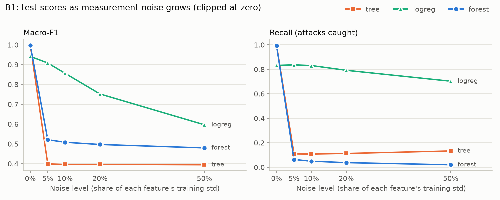
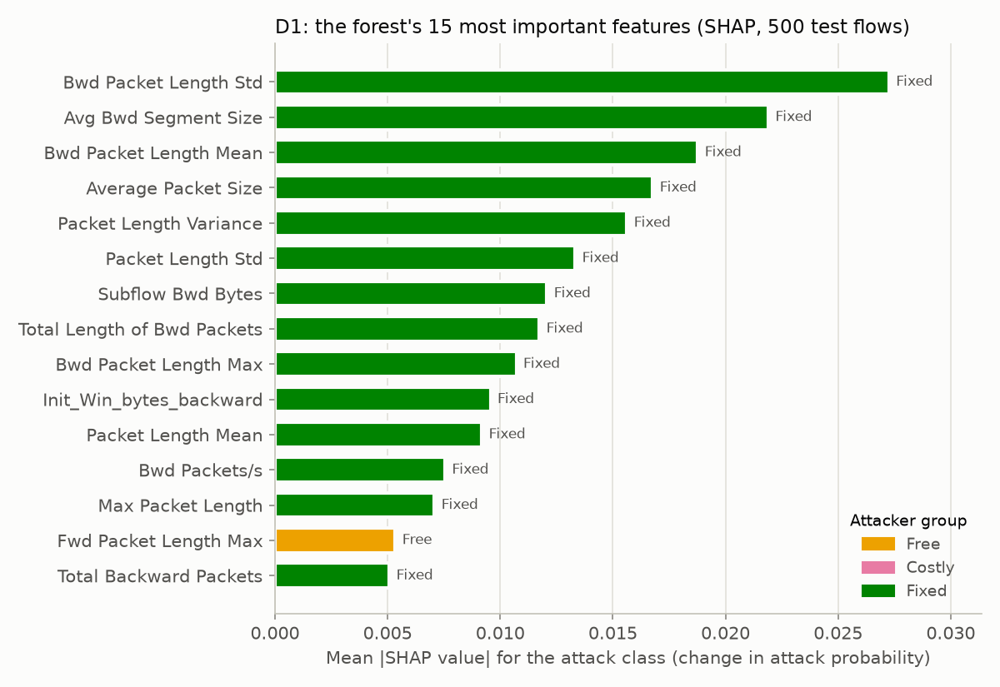
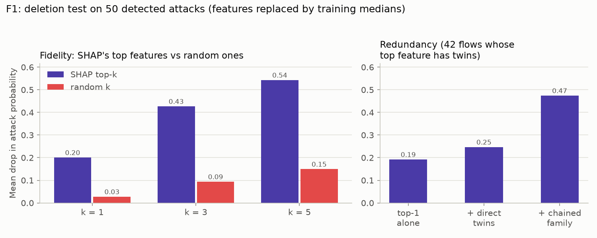
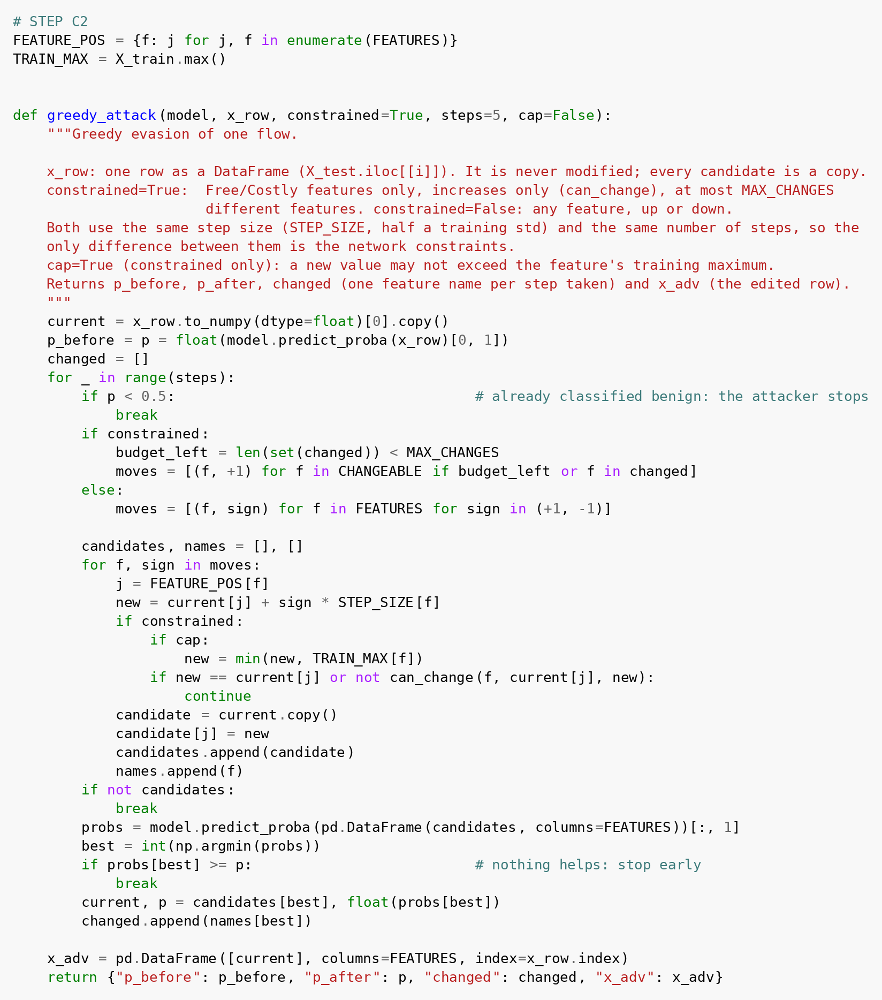

# Lab 4.2: Robustness, Attacks and Honest Explanations

**AI for Cybersecurity (D7084E / D7041E), Group 6** · Kirill Silchenko (kirsil-5@student.ltu.se) · Stefanos Ntentopoulos (stente-5@student.ltu.se) · October 2026

## 1. Problem

An intrusion detector decides for every network flow whether it is an attack or normal traffic. On
clean test data such detectors score close to 1.0, but that score can mislead twice. First, attacks are
a minority, so a model that answers "normal" every time already looks accurate. Second, the test data
are clean and nobody is trying to fool the model. **Robustness** here means how much of the score
survives imperfect data (measurement noise, fields lost by the collector) and a deliberate **evasion
attack**, in which an attacker changes the measurable features of their own traffic, within what a real
attacker can change, until the model calls it normal. We also test whether the SHAP and LIME
explanations of the detector are *stable* and *faithful*, not just convincing.

## 2. Setup

**Data.** The cleaned CICIDS**2017** table from Lab 1 (all eight day-files, 20% stratified sample, ID
columns including destination port and protocol removed): 446,641 flows and 68 numeric features,
**15.07% attacks**. The 60/20/20 split is stratified on the attack type (seed 42): 267,984 training,
89,328 validation and 89,329 test flows (13,461 attacks). The lab text names CICIDS2018; our feature names
are therefore the longer 2017 ones. No infinite or missing values remained after Lab 1's cleaning;
58 features are continuous and 10 are 0/1 flags.

**Models** (all `random_state=42`, all fed the same raw features): a fully grown decision tree; logistic
regression with the scaler inside a pipeline (fitted on training data only); a random forest of 300
trees (depth 20, the setting Lab 1 chose on validation data); and, for the ensemble, gradient boosting
(200 trees, depth 4), trained on a stratified **100,000-row subsample** of the training set to keep its
training time at about 7 minutes. Noise widths, medians and attack step sizes are all measured on the
training set.

**Feature groups for the attack**, assigned by name rules in code (backward or flag → Fixed; timing →
Free; forward sizes → Free; forward counts → Costly; anything uncertain → Fixed):

| Group | Count | Features |
|---|---|---|
| Free | 25 | inter-arrival times, idle and active timers, flow duration, forward packet / header / segment sizes |
| Costly | 5 | total forward packets and bytes, forward subflow packets and bytes, forward data packets |
| Fixed | 38 | all 17 backward features, the 10 flags, mixed-direction size statistics, rates, both initial windows |

*Table 1. Feature groups. The attacker may only raise Free and Costly features, by at most half a training standard deviation per step, and change at most five features.*

## 3. Results

**Baseline.** The always-benign model is 84.9% accurate but catches nothing; the real models are far
above it on every score that counts attacks.

| Model | Accuracy | Macro-F1 | Recall | ROC-AUC | PR-AUC | FAR |
|---|---|---|---|---|---|---|
| always benign | 0.849 | 0.459 | 0.000 | 0.500 | 0.151 | 0.000 |
| decision tree | 0.999 | 0.997 | 0.995 | 0.997 | 0.991 | 0.001 |
| logistic regression | 0.972 | 0.942 | 0.832 | 0.991 | 0.969 | 0.003 |
| random forest | 0.998 | 0.997 | 0.992 | 1.000 | 1.000 | 0.001 |

*Table 2. Clean test set (89,329 flows). FAR = share of benign flows flagged as attacks.*

**Noise and missing values.** Figure 1 shows the effect of noise. At 5% noise the forest keeps only
**0.063 recall** and the tree 0.109, while logistic regression keeps 0.836 and loses only 0.033 macro-F1.
With 10% of each flow's values replaced by training medians the order reverses: forest macro-F1 0.990
(recall 0.968), tree 0.876, logistic regression 0.778 (recall 0.609). Losing *all 17 backward features*
at once, instead of random ones, leaves the forest a recall of **0.001**; the same number of values
missing at random leaves 0.683. Clipping noisy values at zero made no difference for the two tree
models.

*Figure 1. Macro-F1 and recall on the test set as Gaussian noise grows (noise width = share of each feature's training standard deviation; never-negative features clipped at zero).*

**Evasion attack** (greedy search, five steps, on the 50 test attacks the forest is surest about, all at
probability 1.000):

| Attack | Evaded (of 50) | Mean probability after | Mean features changed |
|---|---|---|---|
| forest, constrained | 9 | 0.731 | 4.22 |
| forest, unconstrained | 50 | 0.431 | 2.78 |
| ensemble (forest + boosting + logistic regression), constrained | 11 | 0.725 | 3.94 |

*Table 3. The unconstrained attack may change any feature up or down by the same step; 87% of its steps changed Fixed features.*

The constrained attack evaded 7 of 25 DDoS flows, both DoS GoldenEye flows and none of the 22 DoS Hulk
flows; all nine evasions end just below the threshold (0.41–0.48). Overall it changed forward counts
most often, but the successful evasions mostly *waited longer*: 18 of their 27 steps were timing
changes, led by the shortest gap between packets (`Fwd IAT Min`, +4.8 s per step). No Fixed feature
was ever changed. The ensemble matched the forest on clean data (macro-F1 0.997), helped a little under
5% noise (0.621 vs 0.521) and did slightly worse with missing values (0.973 vs 0.990).

**SHAP versus the attacker.** All ten of the forest's top SHAP features are **Fixed** (Figure 2),
led by the size statistics of the victim's replies; Fixed features carry 77% of the total mean |SHAP|.
The overlap with the attacker's ten most-changed features is **zero**, and the two timing features
behind the DDoS evasions rank only 41st and 58th of 68. Under 5% noise the SHAP ranking of 200 flows has
a Spearman correlation of **0.899** with the clean ranking, just below the lab's 0.90 threshold; over the
20 most important features it is only 0.496.

*Figure 2. Mean absolute SHAP value (attack class) of the forest's 15 most important features on 500 test flows, coloured by attacker group.*

**Do the explanations hold up?** Replacing SHAP's top features with training medians lowers the attack
probability far more than replacing random features (Figure 3): by 0.201, 0.427 and 0.543 for the top 1,
3 and 5 features, against 0.028, 0.094 and 0.150 for as many random ones, and the top five push 30 of the
50 detected attacks below 0.5. The ranking is therefore faithful. For the 42
flows whose top feature has correlated twins, removing it alone costs 0.19, with its direct twins
(|corr| > 0.95) 0.25, and with its whole chain of twins 0.47 (11 flows then fall below 0.5). Base value
plus SHAP values reproduced the forest's probability exactly (largest difference 4e-16) **without** a
sigmoid: for a scikit-learn forest TreeSHAP explains the probability itself, not log-odds (for gradient
boosting the sigmoid is needed). LIME fitted the forest badly: on 20 random test flows its R² ranged from
0.075 to 0.300 (mean 0.175), all below 0.70, and borderline flows (probability 0.3–0.7) fitted no better.

*Figure 3. Deletion test on the 50 detected attacks: features replaced by training medians (random features averaged over 10 draws per flow). Right: the top feature alone, with its direct twins (|corr| > 0.95), and with its whole chain of twins.*

**Feature removal with retraining.** On a fixed 30,000-row training sample, a 100-tree forest varies by
0.0008 macro-F1 between random seeds. Removing one feature and retraining exceeded that only twice (at
most 0.0013, `Fwd IAT Min`). Removing any of the 14 correlation groups (|corr| > 0.95) cost at most
0.0006; even removing all 17 backward features cost 0.0015, all 20 forward features 0.0025, and all 23
timing features 0.0008.

## 4. Discussion

**How much of the score is real?** The forest's accuracy is only 0.149 above the always-benign model,
but it removes 99% of the errors and lifts recall from 0 to 0.992, so on clean data the performance is
real. PR-AUC separated the models almost four times more than ROC-AUC (spread 0.031 vs 0.008), because ROC-AUC
divides false alarms by the 75,868 benign flows. The score is not robust: under noise it depends on the
model, and **no model is safest against both damages**. Contrary to the lab's expectation, the forest
collapsed at 5% noise. Outliers inflate the standard deviation of the timing features by factors of
50,000 to 1,500,000, so even 0.05% of it swamps the microsecond gaps the trees split on; noise on one
feature alone barely hurts because its twins still carry the signal. Logistic regression reads features
in standard-deviation units and survives noise, but loses most when fields go missing. A single tree
breaks earlier than the forest at small noise (recall 0.50 vs 0.79 at 0.1%) because one path decides
instead of 300 votes. Clipping at zero is the fairer test, since a negative packet count cannot exist.

**How much robustness comes from the network?** Most of it. The forest evades 50 of 50 when the attacker
may edit everything and 9 of 50 when only their own traffic may change, and SHAP shows why: the model
leans on the victim's replies, which the attacker cannot forge. To a customer we would quote the
realistic 9 of 50 with its assumptions; to our security team both numbers, because the gap disappears if
the attacker controls the other end. The evasions that worked used free timing changes, and two
"Fixed" reply features are near-copies of attacker-controlled counts, so the protection is weaker than
the labels suggest. SHAP ranks features by their average effect, while the attacker only needs one
feature that tips one flow near the boundary, which is why the useful timing features rank low. The
ensemble helped against random noise but was easier to evade: on the 11 flows that evaded it, the
forest alone still said 0.57–0.86, but logistic regression ended near 0, and a plain average lets the
weakest member decide. It costs about 30 µs per flow in batches, versus about 20 µs for the forest.

**Are the explanations stable and faithful?** SHAP is *faithful* (deletion test, additivity) and only
*borderline stable*: the 68-feature correlation stays near 0.90 mainly because unimportant features stay
unimportant, and for attacks the ranking hardly changed while the forest reversed its decision on 23 of
24, so stability says little about whether the model is right. The single-feature deletion test
understated SHAP's top feature: the information sits in a family of twins, so groups must be removed
together, and the lab's direct-twin group was too small to show it. LIME is neither: its straight line
cannot follow the forest's step-shaped output, so its fit score (free with every explanation) should
gate whether analysts see a LIME explanation at all; the additivity check is also free but only catches
set-up errors, and the deletion test costs extra predictions and suits periodic audits. For an engineer
deciding what to stop collecting, the group answer matters, but our data are redundant far beyond the
0.95 twins: a retrained forest loses almost nothing even without all backward features. Removing a field
is only safe together with retraining (a deployed model collapses when the field disappears), and the
backward features are exactly the evidence an attacker cannot fake, so dropping them would cost security
rather than accuracy.

## 5. Who did what

[Fill in before submitting: one or two lines saying who did which parts of the work.]

**Use of AI.** An AI assistant (Claude, Anthropic) was used to help write the code, run the
experiments and draft this report; every number comes from our notebook run. Libraries: scikit-learn,
SHAP, LIME, pandas, NumPy, SciPy, matplotlib.

<!-- pagebreak -->

## Appendix: code

*Figure 4. The greedy evasion attack from step C2, as it appears in the hand-in notebook.*
